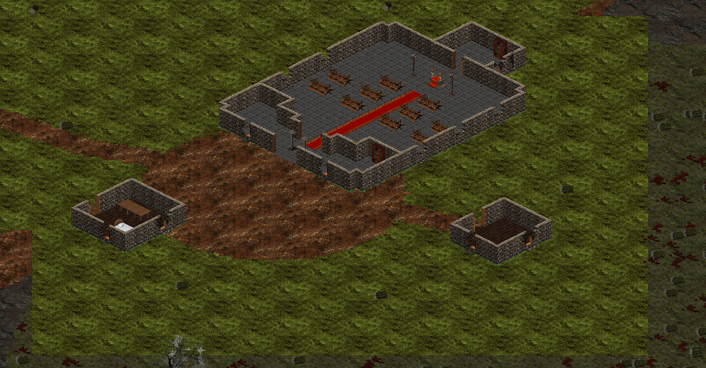
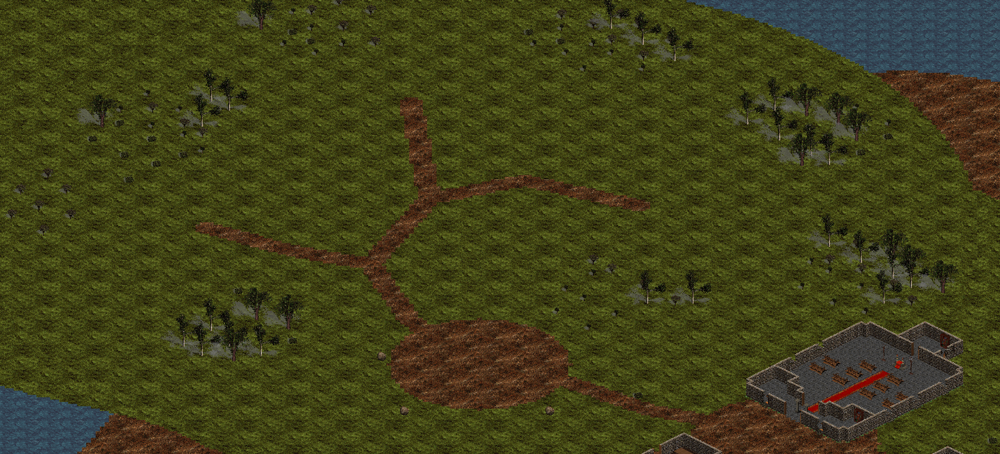
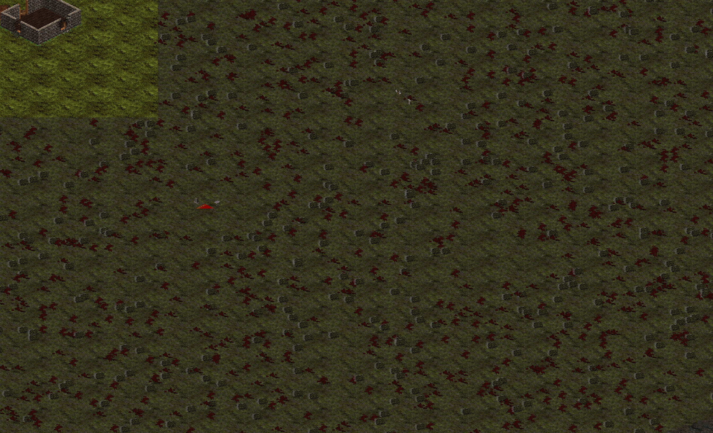
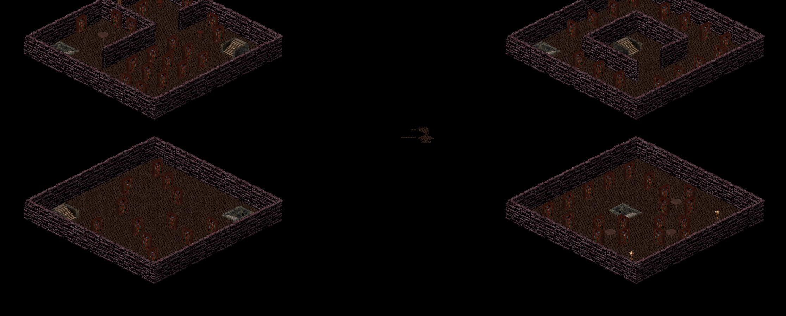

# Avalon — sanctuary, Wilds and eastern relocation

Avalon now occupies its own eastern area of the **5120×3072** world map. Its coordinates moved
**+2700 X**, with Y and map layer unchanged. The Great Library and other original terrain
were restored at their original coordinates. Existing cave and stair links remain there.

## Sanctuary

A complete stone temple encloses the arrival point at **(4040,1477)**. It has an open entrance,
pews and a blessing chest. Two smaller buildings house services; townsfolk stand on protected,
reachable tiles. Safe-haven ground blocks incoming and outgoing combat, including delayed hits.

## Wilds

Paths lead to two Stalker hunting glades, a separate Fey Warden grove and Caradoc's border
clearing. Tree groups frame open travel and fighting areas.

## Fading Veil

Dense overlapping ghost trees have been removed from encounter space. Widely separated trees
retain the blighted woodland setting, with clear space around spawns and routes for fighting
and collecting loot. The restored extended land reaches beyond the two existing quest regions;
additional encounter design and progression balancing remain future work.

## Quest walkthrough

Speak to Elder Ophira inside the temple at **(4044,1462)**:

1. Say **wilds** to hear the mission, then **accept**.
2. Say **route** for directions to the Stalkers and Caradoc.
3. Complete the journal's kill objective and recover Caradoc's Sundered Blade.
4. Return and say **report**. Ophira checks both objectives before advancing.
5. Say **veil** to hear the next chapter, then **accept**.

Existing quest acceptance, completion and kill progress remain intact. Players who already
accepted the Veil quest can still finish it.

## Great Library restoration

The original rooms, floors and stairs occupy their original positions again; Avalon scenery
no longer covers them. Black space outside these interior rooms is part of the original layout.

## Existing saves and travel

Identifiable old Avalon positions and bound respawn points migrate once on loading the save.
Original Library floors and entrances are excluded from this ownership mask. An ambiguous old
position in overlapping original scenery stays in place; unlocked Avalon travel reaches the
new island. Mainland passage coordinates and Rowan's destination in the separate dungeon
remain unchanged. Player possessions, statistics and quest flags do not change.

## Verification

- Full Maven suite: **526 tests passed**, with no failures, errors or skips.
- Ghost-tree pass: **6,911 removed**, five retained clear of encounter areas.
- Original-world audit: **459,233 restored cells**, zero changes outside historical Avalon edits.

The expansion tool compares every tile in the original world: restoration uses historical
Avalon changes, while unrelated terrain, decor, offsets, scales, draw order and collision must
remain identical. Regression tests cover Library floor and stair positions, map dimensions,
save migration, protected town services, hunting connectivity and ghost-tree clearance.

The images use the game's OpenGL terrain/decor/object renderer. They omit characters and
are scenery checks, not an interactive gameplay recording.

See [map editor instructions](../map-editor.md) for the launcher, preview tool and overview
regeneration steps.
